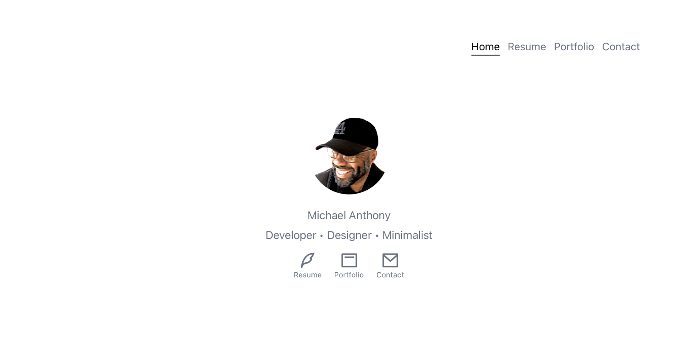

# Simple Shell

A production ready personal website or portfolio boilerplate.
 

[Demo](https://simple-shell.moquette.us) | [Code](https://github.com/moquette/simple-shell)

## Scripts

**yarn start:**

Start development server and lanches default browser.

**yarn build:**

Builds and bundles resources for production.
