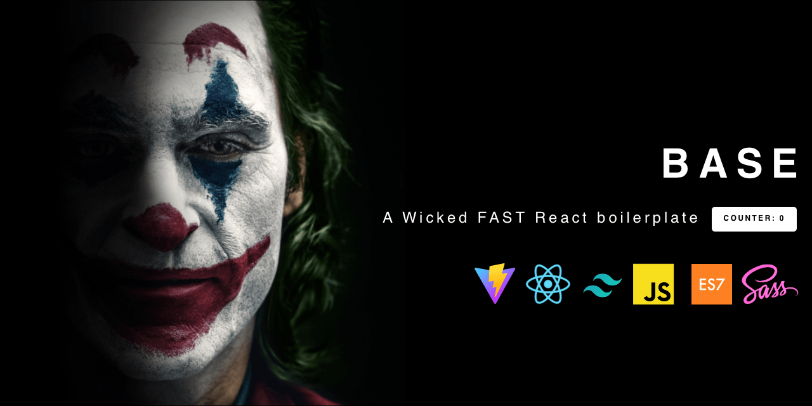
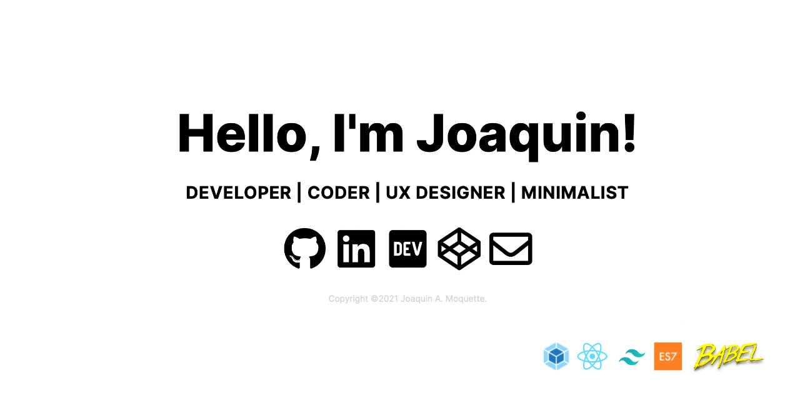
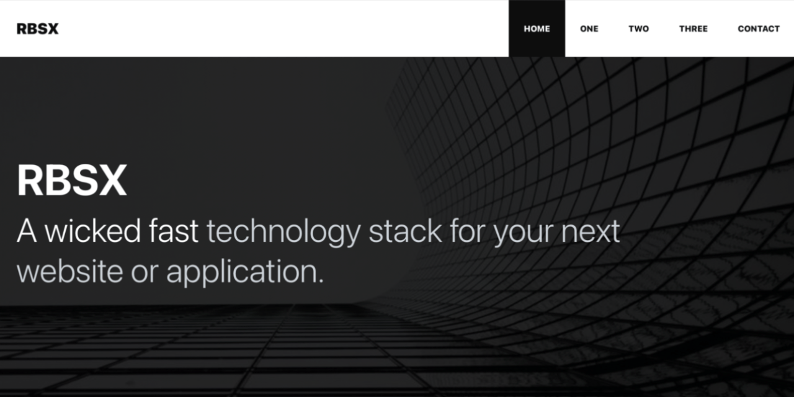
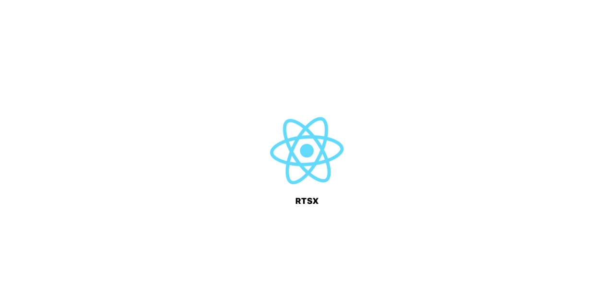
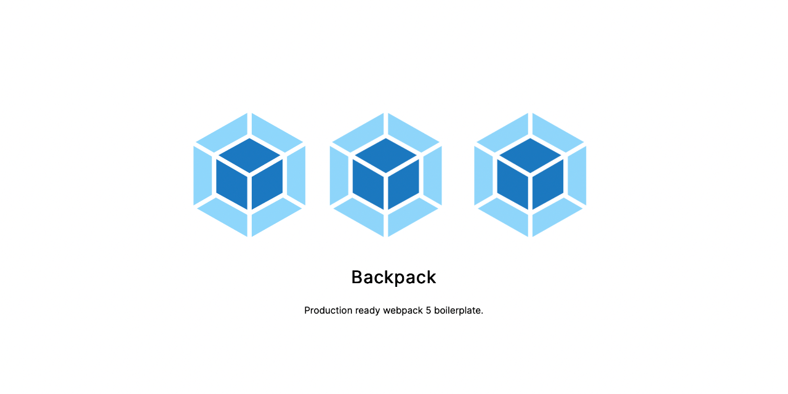

# Base

A wicked **FAST** React boilerplate.

 

[Demo](https://base.moquette.us) | [Code](https://github.com/moquette/base)

# Hello

A minimalistic cover page that makes a perfect GitHub user landing page, Single Page Application (SPA).

[Demo](https://hello.moquette.us) | [Code](https://github.com/moquette/hello)

# RBSX

RAD Technology stack for your next website or application.

[Demo](https://rbsx.moquette.us) | [Code](https://github.com/moquette/rbsx)

# RTSX

A wicked FAST Next.js stack for your next website or application.

[Demo](https://rtsx.moquette.us) | [Code](https://github.com/moquette/rtsx)

# Backpack

A production ready webpack 5 boilerplate.

[Demo](https://backpack.moquette.us) | [Code](https://github.com/moquette/backpack)
